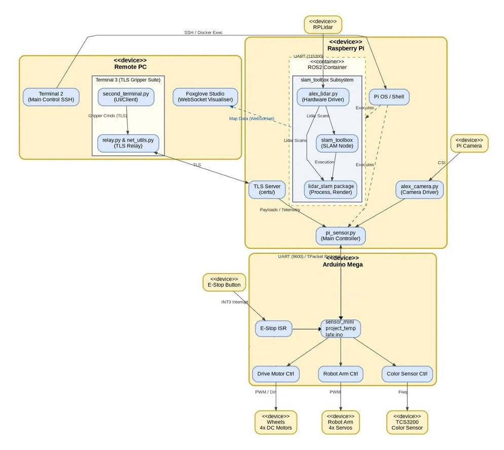
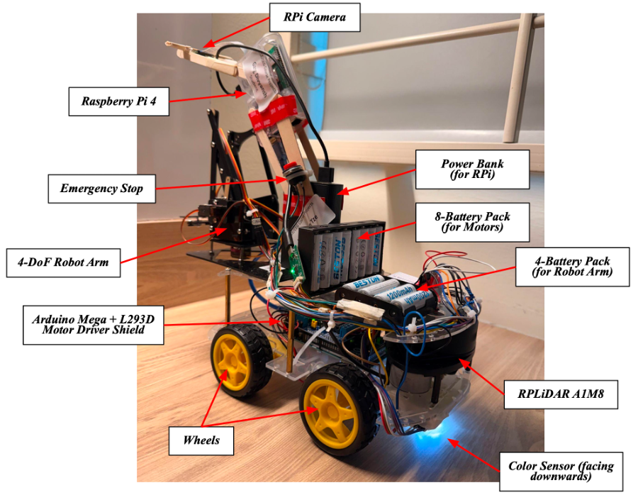
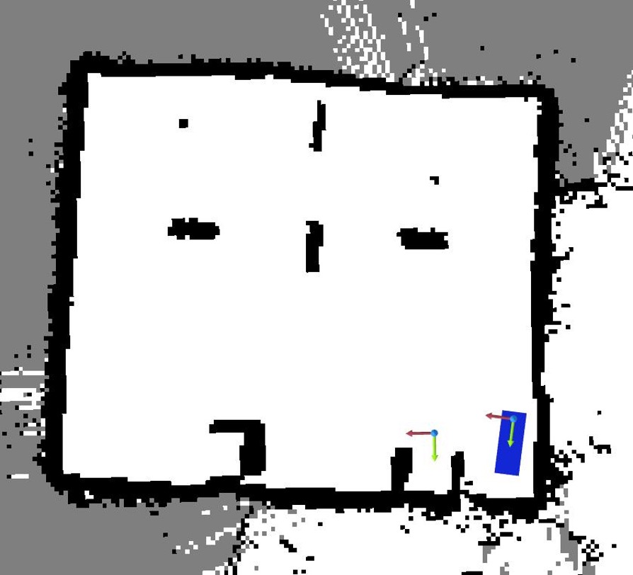
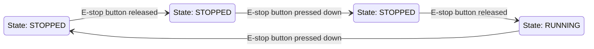
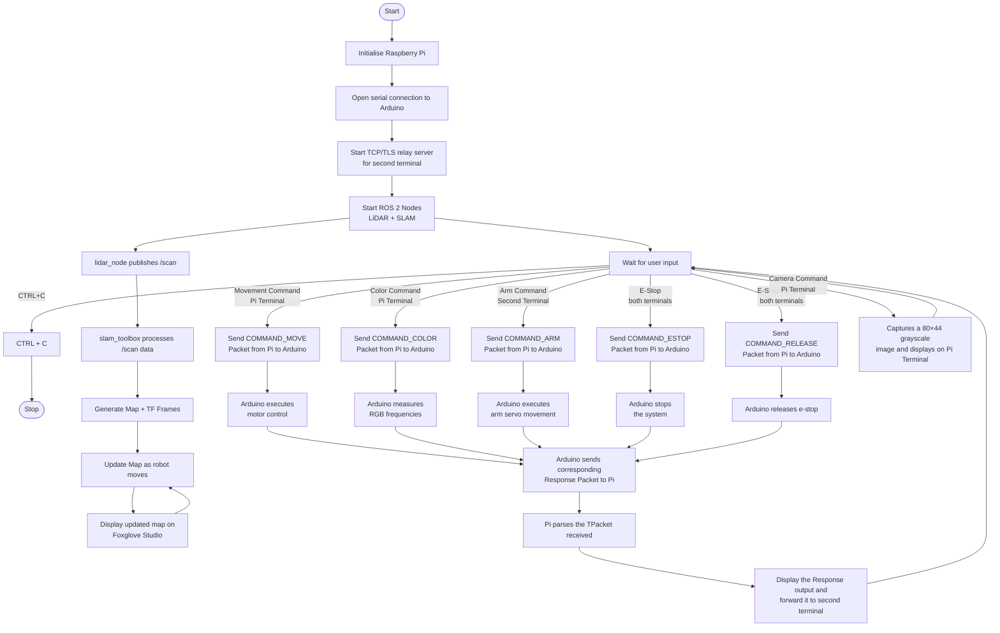

# 🤖 Alex to the Rescue  
### CG2111A Engineering Principles and Practice II  
**Team B02-G7 | Semester 2 AY2025/2026**

   
       

---

## 📋 Table of Contents

- [Section 1: Introduction](#section-1-introduction)
- [Section 2: Review of State of the Art](#section-2-review-of-state-of-the-art)
  - [2.1 Clearpath Jackal UGV](#21-clearpath-jackal-ugv)
  - [2.2 Endeavor Robotics 310 SUGV](#22-endeavor-robotics-310-sugv)
- [Section 3: System Architecture](#section-3-system-architecture)
- [Section 4: Hardware Design](#section-4-hardware-design)
- [Section 5: Firmware Design](#section-5-firmware-design)
  - [5.1 High-Level Algorithm – Arduino Mega](#51-high-level-algorithm--arduino-mega-low-level-controller)
  - [5.2 Communication Protocol](#52-communication-protocol)
- [Section 6: Software Design](#section-6-software-design)
  - [6.1 High-Level Algorithm – Raspberry Pi](#61-high-level-algorithm--raspberry-pi-high-level-controller)
  - [6.2 SLAM](#62-simultaneous-localization-and-mapping-slam)
  - [6.3 Emergency Stop System](#63-emergency-stop-system)
  - [6.4 Movement Control](#64-movement-control)
  - [6.5 Color Sensing (TCS3200)](#65-color-sensing-tcs3200)
  - [6.6 Arm Control](#66-arm-control)
  - [6.7 Camera Control](#67-camera-control)
  - [6.8 Secure Remote Communication](#68-secure-remote-communication-tls-over-tcp)
- [Section 7: Lessons Learnt – Conclusion](#section-7-lessons-learnt--conclusion)
- [Appendix](#appendix)
- [References](#references)

---

## 🚀 Section 1: Introduction

The Moonbase SG Rescue Mission is a search and rescue quest in the lunar environment. After an unexpected sudden oxygen tank explosion, astronauts are severely injured and are unable to move around to retrieve medical supplies. This emergency requires urgent supply of medical supplies (medpaks) to sustain them.

To supply the medpak, the project focuses on designing and building a remotely operated rescue robot **'Alex'** with two operators. Alex navigates through an unknown environment with obstacles that represent the damaged moonbase. Using sensors such as LiDAR, a color sensor, and a camera, the robot must detect medpak locations, avoid obstacles, and understand its surroundings. It uses a robotic arm to pick up the correct medpak and deliver it safely to the astronauts. Additionally, the robot is also expected to map the environment for future rescue operations.

The system operates under strict constraints: limited camera usage (maximum 15 photographs), remote control without actual view of the environment, and precise and simultaneous coordination between multiple operations.

This project integrates mechanical, electronic, and software components to solve a real-world problem. It gives real experience challenges in robotics, including navigation, sensing, control, and system coordination in a time-critical rescue scenario.

---

## 🔍 Section 2: Review of State of the Art

### 🚙 2.1 Clearpath Jackal UGV

The Clearpath Jackal is a compact, four-wheeled unmanned ground vehicle (UGV) designed for research and field deployment. It is tele-operated via a wireless interface and controlled using either a joystick or laptop-based software interface, supporting multi-operator configurations. The Jackal is built around a ROS-compatible computer, enabling easy integration of payloads and software stacks. Its standard sensor suite includes an IMU and GPS, with commonly added payloads including LiDAR, stereo cameras and a robotic arm. The platform supports extended battery operation of approximately 4–6 hours depending on the payload, with real-time sensor data streamed to operator interfaces.

### 🦾 2.2 Endeavor Robotics 310 SUGV

The Endeavor Robotics 310 SUGV (Small Unmanned Ground Vehicle) is a compact, man-portable, tele-operated ground robot widely used by military, law enforcement and SAR teams. It is remotely controlled by a single operator via a rugged Android tablet-based GUI (the uPoint Multi-Robot Control System) over a mesh radio wireless link, requiring no line-of-sight. The uPoint control system also supports the operation of multiple robots, reducing training time. The platform uses a tracked drivetrain to allow it to climb and descend stairs, traverse rubble and rough terrain, and operate in all-weather conditions. It is equipped with four day/night cameras with zoom for situational awareness and supports a modular arm attachment for object retrieval and manipulation.

**Table 1: Strengths and weaknesses of Clearpath Jackal and Endeavor Robotics 310**

| | Clearpath Jackal | | Endeavor Robotics 310 | |
|---|---|---|---|---|
| | **Strengths** | **Weaknesses** | **Strengths** | **Weaknesses** |
| Mobility | Highly modular and extensible | Wheeled drivetrain instead of tracked | All-terrain mobility (tracked drivetrain) | Designed for single operator (increased cognitive load on user) |
| Control | Allows multi-operator control | Not designed for extreme impact or water immersion | Able to control without line-of-sight | |

---

## 🏗️ Section 3: System Architecture
**Figure 1: UML Deployment Diagram for System Architecture**




---

## ⚙️ Section 4: Hardware Design

The Alex Robot comprises a 4WD 2-layer chassis:

- **Bottom layer:** Arduino Mega, L293D Motor Driver Shield, LiDAR Sensor, 4 DC motors, TCS3200 color sensor, color sensor and E-stop circuit breadboard (on underside)
- **Top layer:** 4-DoF Robot Arm (MeArm v0.4), Raspberry Pi 4, RPi Camera, 4-Battery Pack (for robot arm), 8-Battery Pack (for motors), 10000mAh Power Bank (for RPi), Emergency Stop button, breadboard for robot arm circuit

**Figure 2: Alex chassis hardware design**



The camera is mounted on the RPi, which is in turn mounted over the Power Bank via ice cream sticks and tape such that the camera overlooks the arm gripper during medpak retrieval. Zip ties, masking tape and double-sided tape are used for cable management and securing all other components on Alex's chassis.

---

## 🔧 Section 5: Firmware Design

### 🧠 5.1 High-Level Algorithm – Arduino Mega (Low-level Controller)

#### ⚡ 5.1.1 Initialization

- Serial communication initialized at **9600 bps** (8N1 format) for UART communication with the Raspberry Pi
- GPIO registers configured for motor control outputs, color sensor (PORTA), and arm servo PWM control (PORTB)
- Timer5 configured for arm servo control (20 ms period)
- External interrupts enabled:
  - `INT2_vect` → color sensor frequency counting
  - `INT3_vect` → e-stop button handling
- Global interrupts enabled using `sei()`

#### 🔁 5.1.2 Main Execution Loop

The Arduino continuously executes the following loop:

1. **Check E-stop state** — if button triggers state change, Arduino sends updated status packet to RPi
2. **Receive Command Packet** — continuously polls UART using `receiveFrame()`, synchronizes using MAGIC number, validates checksum, deserializes into `TPacket`
3. **Command Dispatch** — if valid packet, forwards to `handleCommand()` and executes corresponding subsystem action (motor control, color sensor, arm control, e-stop handling)
4. **Send Response Packet** — sends `RESP_OK` (acknowledgement), `RESP_STATUS` (RUNNING / STOPPED), or `RESP_COLOR` (color sensor RGB frequency data)

This polling-based control loop ensures deterministic execution while maintaining responsiveness to interrupts and commands.

---

### 📡 5.2 Communication Protocol

#### 🔌 5.2.1 UART Configuration

The Raspberry Pi establishes a serial connection with the Arduino Mega.

- **Baud Rate:** 9600 bps
- **Frame Format:** 8 data bits, no parity, 1 stop bit (8N1)

---

#### 📦 5.2.2 Packet Structure

A custom fixed-length packet-based protocol (**TPacket**) is implemented to ensure reliable communication.

Frame Structure (Total: 103 bytes): MAGIC (2 bytes) | TPacket (100 bytes) | CHECKSUM (1 byte)

- **MAGIC Number:** `0xDEAD` (used for synchronization)
- **CHECKSUM:** XOR of payload (ensures data integrity)

#### TPacket Definition

```c
typedef struct {
    uint8_t  packetType;    // COMMAND / RESPONSE / MESSAGE
    uint8_t  command;       // Instruction (MOVE, COLOR, ARM, etc.)
    uint8_t  dummy[2];      // Padding
    char     data[32];      // ASCII payload
    uint32_t params[16];    // Numeric parameters
} TPacket;
```

#### 📊 Field Descriptions

**Table 2: TPacket field descriptions**

| Field | Type | Description |
|-------|------|-------------|
| packetType | `uint8_t` | COMMAND / RESPONSE / MESSAGE |
| command | `uint8_t` | Specific instruction (MOVE, COLOR, ARM, etc.) |
| dummy | `uint8_t[2]` | 16-bit padding array |
| data | `char[32]` | ASCII payload (e.g., movement direction, arm joint) |
| params | `uint32_t[16]` | Numeric parameters (e.g., arm angles, RGB values) |

---

#### 🔄 5.2.3 Packet Handling Mechanism

**Raspberry Pi Side:**

- `receiveFrame()` — continuously receives bytes from serial, synchronizes using MAGIC number, validates checksum, deserializes packet into structured format
- `packFrame()` — serializes command into `TPacket`, adds checksum and framing, sends via serial

**Arduino Side:**

- `receiveFrame()` — validates packet structure, extracts commands and parameters
- `sendFrame()` — constructs response packets, sends structured feedback

This ensures robust bidirectional communication, even in the presence of noise or partial reads.

---

#### 📋 5.2.4 Command and Response Types

**Table 3: Command types implemented**

| Command | Function |
|---------|----------|
| `COMMAND_MOVE` | Robot Movement |
| `COMMAND_COLOR` | Trigger color sensor RGB measurement |
| `COMMAND_ARM` | Robot Arm Movement |
| `COMMAND_ESTOP` | Activate emergency stop |
| `COMMAND_RELEASE` | Release emergency stop |

**Table 4: Response types implemented**

| Response | Description |
|----------|-------------|
| `RESP_OK` | Command acknowledgement |
| `RESP_STATUS` | Robot state (RUNNING / STOPPED) |
| `RESP_COLOR` | RGB frequency values |

---

## 💻 Section 6: Software Design

### 🧩 6.1 High-Level Algorithm – Raspberry Pi (High-level Controller)

#### 🔄 6.1.1 Execution Flow

1. Initialize serial communication with Arduino
2. Start TCP/TLS relay server for remote second terminal connection
3. Enable raw terminal input mode for real-time key detection
4. Enter continuous control loop:
   - Read incoming packets from Arduino and display outputs
   - Forward received packets to remote client via relay
   - Capture user keypress (non-blocking)
   - Process commands entered on the Pi/second terminal accordingly
5. On termination (`CTRL + C`): stop robot safely, close serial and network connections, release resources (camera, relay, etc.)

#### ⌨️ 6.1.2 Input Handling and Command Dispatch

The system operates in a real-time, non-blocking loop using `select()` to capture single keypress inputs. Movement commands (`w, a, s, d`) are handled continuously, allowing the robot to move only when the key is held. Other commands (`c, p, e`) are executed as one-shot actions.

#### 🔗 6.1.3 Serial Communication with Arduino

Commands are encoded into a structured `TPacket` format and transmitted via UART. Incoming packets from the Arduino are continuously monitored, decoded, and displayed to the user. This ensures real-time feedback for sensor readings and system state.

#### 🖥️ 6.1.4 Multi-Terminal Relay

A relay module runs alongside the main loop, forwarding packets between the Arduino and a secondary remote client. This enables concurrent local control and remote monitoring without blocking execution.

---

### 🗺️ 6.2 Simultaneous Localization and Mapping (SLAM)

SLAM for Alex was implemented using **slam_toolbox** within a ROS 2 framework, enabling real-time map construction and pose estimation.

#### 📡 6.2.1 Environmental Data Acquisition (LiDAR)

The **RPLiDAR A1M8** performs continuous 360° scanning of the environment. A custom ROS 2 node (`lidar_node`), in the `lidar_slam` package, processes raw scan data into structured format by:

- Filtering invalid or zero-distance readings
- Converting measurements from mm to meters
- Organizing the data into a fixed **360-point angular grid**

The processed data is published as `LaserScan` messages on the `/scan` topic, serving as the system's primary source of spatial data.

#### 🧭 6.2.2 Scan Matching & Frame Configuration

Since hardware odometry is not utilized, motion estimation relies on LiDAR data. The system uses **scan matching** — algorithmically comparing how the environment's geometry changes between consecutive laser sweeps to estimate motion. In the SLAM configuration file, `base_frame` and `odom_frame` are both set to `base_link`, removing the need for a separate odometry frame.

**Table 5: SLAM frame descriptions**

| Frame | Description |
|-------|-------------|
| `map` | Global reference frame |
| `base_link` | Robot's physical center |
| `laser` | LiDAR sensor's reference frame |

A static transform between `base_link` and `laser` specifies a fixed spatial relationship between the LiDAR sensor and the robot body, ensuring that all scan data is correctly positioned relative to the robot into the global map during SLAM processing.

#### ⚙️ 6.2.3 Core SLAM Processing

The `slam_toolbox` node acts as the central mapping engine, subscribing to both the raw `LaserScan` data and the inferred spatial relationships. Since the robot operates dynamically, this node runs in **asynchronous mode**, processing incoming data as soon as it is available. This prioritizes real-time performance and prevents computational overhead on the RPi.

To improve stability:
- Scan matching is constrained within a limited search radius and angle
- Only high-confidence matches are accepted
- **Loop closure** is enabled, allowing the system to correct accumulated drift while revisiting previously mapped areas

The node consumes `LaserScan` data published in the `laser` frame and transforms it through the TF chain (`laser → base_link → map`) for scan alignment and pose estimation.

#### 🗺️ 6.2.4 Map Generation and Serialization

As the robot navigates, the algorithm resolves the scan-matched data into a **2D occupancy grid map**, representing occupied space (obstacles), free space and unknown regions. This map is built upon a pose-graph architecture:

- **Nodes** → robot poses
- **Edges** → spatial constraints between scans

The map is continuously updated with a fine resolution of **0.03 m**, improving environmental detail and obstacle definition. The pose-graph structure also allows for future serialization, enabling reuse or extension of mapped environments.

#### 📊 6.2.5 Telemetry and Remote Visualization

In the final stage of the pipeline, the generated map and robot pose are published over the ROS 2 network:

- `/map` → Occupancy grid
- `/scan` → LiDAR data
- `/tf` → Robot pose

A dedicated container running a **Foxglove WebSocket bridge** and an external visualizer (**Foxglove Studio**) intercepts this stream. This allows the team to:

- Remotely monitor real-time map generation
- Observe scan alignment and matching quality
- Track the robot's position through a graphical interface without running heavy UI software directly on the Pi

---

### 🛑 6.3 Emergency Stop System

#### 🔩 6.3.1 Implementation

- Uses external interrupt (`INT3_vect`)
- Triggered on button state change

#### ✅ 6.3.2 Features

- Debouncing using time threshold
- Immediate motor shutdown
- Overrides all commands

#### 💻 6.3.3 Software E-Stop

- Triggered via `COMMAND_ESTOP` from Pi
- Sets system to STOPPED state

---

### 🚗 6.4 Movement Control

#### 🔩 6.4.1 Components

- L293D Motor Shield
- 4 DC Motors (Front Left – M4, Front Right – M1, Back Left – M3, Back Right – M2)
- AFMotor Library (Software)

#### 🕹️ 6.4.2 Control Algorithm

- Implemented using a continuous keypress-based control scheme
- System detects real-time keyboard input
- Transmits movement commands as long as the corresponding key is being held
- If no key detected within a short period (0.2 seconds), sends stop command
- Improves responsiveness and provides a more intuitive teleoperation experience

Arduino receives `COMMAND_MOVE` from Raspberry Pi:
1. Command is parsed from `data[0]`
2. Speed is updated if required
3. Corresponding movement function is executed
4. All motors are set using `setSpeed(speed)` and `run(direction)`

**Speed Control:**
- PWM range: 0–255 (default: 130)
- Constrained to 80–255
- `+ / -` adjusts speed by 10 and reapplies the last motion with updated speed

---

### 🎨 6.5 Color Sensing (TCS3200)

#### 🔩 6.5.1 Hardware Configuration

- Control pins: S0–S3
- Output pin: frequency signal

#### 🔬 6.5.2 Operation

- Frequency scaling set to 20% (refer to Appendix C)
- Color filters selected to produce red, blue and green photodiode lighting (refer to Appendix C); frequency measured for each
- Command `c` triggers color sensor
- The Pi checks E-stop state and sends `COMMAND_COLOR` to the Arduino if E-stop is released

**Frequency Measurement:**
- Interrupt (`INT2_vect`) counts rising edges
- Measurement window: 100 ms
- Frequency calculation: `frequency (Hz) = edge_count × 10`

**Data Transmission:**
- Frequencies for RGB stored in `params[0..2]`
- Sent as `RESP_COLOR` packet

---

### 🦿 6.6 Arm Control

#### 🔩 6.6.1 Hardware

- 4-DoF robotic arm (MeArm v0.4)
- 4 servo motors: Base, Shoulder, Elbow, Gripper

#### ⚡ 6.6.2 PWM Generation

- Timer5 configured in CTC mode
- Period: 20 ms
- Pulse width: 1–2 ms (mapped from servo angle)

#### 🧠 6.6.3 Control Logic

- Robot arm control commands are sent from second terminal to Raspberry Pi
- Arduino receives `COMMAND_ARM` from Raspberry Pi
- Joint identifier extracted from `data[0]`; target angle from `params[0]`
- Movement executed via `moveSmooth()`:
  - Gradual interpolation
  - Prevents jerky motion
  - Each joint has experimentally derived min/max angle limits; target angle values are clamped before execution

**Command Format:**

```
<Joint><3-digit angle>
Example: B090
```

**Special cases:**
- `H` → homes all joints (no angle required)
- `Vxxx` → sets servo movement speed (ms per degree of rotation)

---

### 📷 6.7 Camera Control

#### 🔬 6.7.1 Operation

- Command `p` triggers image capture
- Pi checks: E-stop state and remaining frame count
- Captures a **grayscale image** at resolution **80 × 44**
- Uses provided `alex_camera.py` file for camera operations
- Displays image in terminal

**Constraint Handling:**
- Maximum frames: **15** (frame counter decremented after each capture)
- No frame captured if current robot state is STOPPED (E-stop active)

---

### 🔐 6.8 Secure Remote Communication (TLS over TCP)

To support remote operation, a secure TCP communication channel was implemented between the Raspberry Pi and a second terminal using TLS.

#### 🏛️ 6.8.1 Architecture

The Raspberry Pi acts as the TCP server, relaying data between the Arduino (via serial) and the remote client (via network socket). All data exchanged follows the same `TPacket` framing protocol, ensuring consistency across communication layers.

#### 🔒 6.8.2 TLS Security Properties

The TLS layer ensures three key security guarantees:

- **Confidentiality:** All data transmitted is encrypted, preventing interception or packet sniffing over the network
- **Integrity:** Message integrity ensures that packets are not modified during transmission
- **Authentication:** The client verifies the server's certificate to ensure it is communicating with the correct Raspberry Pi

#### ⚙️ 6.8.3 Operation

- Sensor data and responses from the Arduino are forwarded to the remote client
- Commands from the client (e.g., E-stop, arm control) are securely transmitted back to the robot
- A threaded receiver ensures continuous packet handling without blocking user input

---

## 📝 Section 7: Lessons Learnt – Conclusion

### 💡 7.1 Lessons

#### 📸 7.1.1 Camera Placement

Before the trial run, we iterated through several different placements for our camera, ranging from behind the robotic arm to under the arm, before finally settling for an overhead image. We initially angled the camera outwards, giving an angled view of each plane (height, width, depth), believing this would maximize spatial information for the camera operator. However, during practice and the trial run, the off-angle placement did not give us enough information to understand how far, high or offset the grippers were — making it essentially a guessing game. This cost us precious time as the images did not provide sufficient information to decide how much to move the arm, and we ultimately failed to pick up the medpak in the trial run.

After the trial run, the rules were amended so that the height of the medpak was fixed, allowing us to move the camera from a 45-degree angle to an almost top-down view. We then preset the grippers to the height of the medpak's neck, ensuring that we only needed to move the grippers forwards and backwards, significantly reducing complications.

#### ⏱️ 7.1.2 Making More Time for Practicing Under Timed Conditions

One recurring issue before the trial run was that we made changes to individual parts and tested them in isolation. While useful for iterating ideas, this meant we had limited practice running the complete integrated system under real conditions. We were not proficient at transitioning from navigating the maze to the gripping process.

We identified this issue and spent the week before the final run practicing by making a trial maze in the room with blocks of A4 packaged paper to simulate actual running conditions. This gave us enough experience to confidently traverse the maze in the final run.

### ⚠️ 7.2 Mistakes

#### 🗓️ 7.2.1 Optimistic Timeline for SLAM Implementation

Initially, we felt the baseline SLAM was unreliable and sought better processing systems. Knowing there was existing documentation for Hector SLAM, we were optimistic it would be quick to implement. However, Hector SLAM being ROS 1-only (no longer supported) caused significant complications. We eventually resolved this by using `slam_toolbox` on ROS 2, and also found **Foxglove Studio** as a clean visualizer for the SLAM output. However, the uncertainty around having SLAM ready for the trial run was stressful. In retrospect, we would have allocated more time towards the SLAM implementation from the start.

#### 🎮 7.2.2 Holding WASD Keys for Movement

Initially, we intended for the robot to move by holding down WASD keys, similar to a video game. However, during testing there was a noticeable delay between key presses and updates in the SLAM visualizer, leading to unreliable navigation.

To work around this, we practiced to understand how long a key press corresponded to distance moved on the visualizer. Our operator spent time calibrating their intuition for the control scheme, learning how long a key press corresponded to what distance Alex moved. This helped save time during the actual run, particularly for large movements in open areas far from walls.

---

## 📎 Appendix

### 🐳 Appendix A: ROS 2 Docker and SLAM Environment Setup

ROS 2 is deployed in a Docker container on the Raspberry Pi to ensure a consistent, reproducible environment for LiDAR and SLAM. This isolates dependencies while retaining direct hardware access.

#### 🖥️ A.1 System Requirements

- Raspberry Pi running Pi OS (Debian 13)
- RPLiDAR (USB, `/dev/ttyUSB0`)

#### 📥 A.2 Docker Installation

```bash
curl -fsSL https://get.docker.com -o get-docker.sh
sudo sh get-docker.sh
sudo usermod -aG docker $USER
newgrp docker
```

#### 🛠️ A.3 Docker Image Setup

The system is built on top of the official ROS 2 base image.

```bash
docker pull osrf/ros:humble-desktop
```

A custom Docker image (`my_slam_image`) was then created from the base image, with the additional packages `lidar_slam` (custom) and `slam_toolbox`. This ensured all dependencies were pre-installed and optimized for deployment. The packages are set up after the workspace setup (A.5).

#### ▶️ A.4 Running the Container

```bash
docker run -it \
  --net=host \
  --privileged \
  -v /dev:/dev \
  -v ~/ros2_ws:/ros2_ws \
  my_slam_image
```

#### 📁 A.5 ROS 2 Workspace Setup

```bash
mkdir -p /ros2_ws/src
cd /ros2_ws
colcon build
source install/setup.bash
```

Thereafter, set up the `lidar_slam` (custom) and `slam_toolbox` packages inside the created ROS 2 workspace.

#### 🚀 A.6 Running SLAM

```bash
ros2 run lidar_slam lidar_node

ros2 launch slam_toolbox online_async_launch.py \
  slam_params_file:=/ros2_ws/slam_config.yaml
```

Static transform:

```bash
ros2 run tf2_ros static_transform_publisher \
  0 0 0 0 0 3.14159 base_link laser
```

#### 👁️ A.7 Visualization

```bash
ros2 launch foxglove_bridge foxglove_bridge_launch.xml port:=8765
```

Monitored topics: `/map`, `/scan`, `/tf`

A URDF Model was used for visualization:
- **Dimensions:** 17 cm × 30 cm rectangular footprint
- **Sensor Offset:** LiDAR positioned at ~5 cm from the front edge of the robot

**Figure A: SLAM Visualization during Final Run**



> **Note:** SLAM map may appear noisy because screenshot was taken after Alex was removed from the obstacle course.

---

### 🕹️ Appendix B: Alex Control Command Interface

#### 🎮 B.1 Teleoperator Commands

**Table B.1: Teleoperating commands and their respective functions**

| Command | Function |
|---------|----------|
| `w, a, s, d` | Movement (forward, left, reverse, right) |
| `+ / -` | Speed adjustment |
| `x` | Stop motors |
| `c` | Color detection |
| `p` | Camera capture |
| `e` | Emergency stop (Software) |
| `r` | Emergency stop release (Software) |
| Arm commands | Robot arm control |

#### 🚗 B.2 Movement Control Commands

**Table B.2: Movement control commands and their respective functions**

| Command | `w` | `s` | `a` | `d` | `x` | `+ / -` |
|---------|-----|-----|-----|-----|-----|---------|
| Function | Forward | Backward | Clockwise Rotation | Counter-clockwise Rotation | Stop Motors | Increase / Decrease Speed |

#### 🦿 B.3 Arm Control Commands

**Table B.3: Robot arm control commands**

| Command / Format | Joint / Function | Description | Parameter (`params[0]`) | Range / Notes |
|------------------|------------------|-------------|------------------------|---------------|
| `H` | Home Position | Moves all joints to default (90°) | Not used (set to 0) | Resets entire arm |
| `Vxxx` | Speed Control | Sets speed of arm movement | Delay (ms per degree) | 5–100 (lower = faster) |
| `Bxxx` | Base Joint | Rotates base of arm | Target angle (degrees) | 5–180 |
| `Sxxx` | Shoulder Joint | Moves shoulder up/down | Target angle (degrees) | 70–170 |
| `Exxx` | Elbow Joint | Moves elbow joint | Target angle (degrees) | 0–90 |
| `Gxxx` | Gripper | Opens/closes gripper | Target angle (degrees) | 80–95 |
| `o` | Gripper | Opens gripper | 0 (mapped to 80°) | — |
| `c` | Gripper | Closes gripper | 180 (mapped to 95°) | — |

---

### 🎨 Appendix C: Color Sensor (TCS3200) Configuration Table

**Table C.1: TCS3200 S0:S1 pin configurations for frequency scaling**

| S0 | S1 | Output Frequency Scaling |
|----|----|--------------------------|
| L  | L  | Power down (output disabled) |
| L  | H  | 2% |
| H  | L  | 20% |
| H  | H  | 100% |

**Table C.2: TCS3200 S2:S3 pin configurations for color channel selection**

| S2 | S3 | Selected Channel |
|----|----|-----------------|
| L  | L  | Red |
| L  | H  | Blue |
| H  | L  | Clear (no filter) |
| H  | H  | Green |

---

### 🛑 Appendix D: Emergency Stop System

**Table D: E-Stop state transitions**

| Current State | Event | Next State |
|---------------|-------|------------|
| RUNNING | Button Pressed | STOPPED |
| STOPPED | Button Released | RUNNING |
| STOPPED | Button Pressed | STOPPED (no change) |
| RUNNING | Button Released | RUNNING (no change) |

**Figure D: E-Stop State Transition Diagram**


 
---

### 🔄 Appendix E: Overall System Flow

**Figure E: Overall System Flowchart**



---

## 📚 References

- Microchip Technology Inc. (2016). *ATmega2560 Datasheet: 8-bit AVR Microcontroller.* Available: https://ww1.microchip.com/downloads/en/devicedoc/atmel-2549-8-bit-avr-microcontroller-atmega640-1280-1281-2560-2561_datasheet.pdf

- Endeavor Robotics. (n.d.). *310 SUGV Specification Sheet.* Available: https://www.dndkm.org/DOEKMDocuments/GetMedia/Technology/2785-Endeavor%20Robotics%20310%20SUGV%20Spec%20Sheet.pdf

- Clearpath Robotics. (n.d.). *Jackal Unmanned Ground Vehicle Specification Sheet.* Available: https://clearpathrobotics.com/jackal-small-unmanned-ground-vehicle/

- Macenski, S. et al. (2021). SLAM Toolbox: SLAM for the dynamic world. *Journal of Open Source Software*, 2783. doi:10.21105/joss.02783

---
